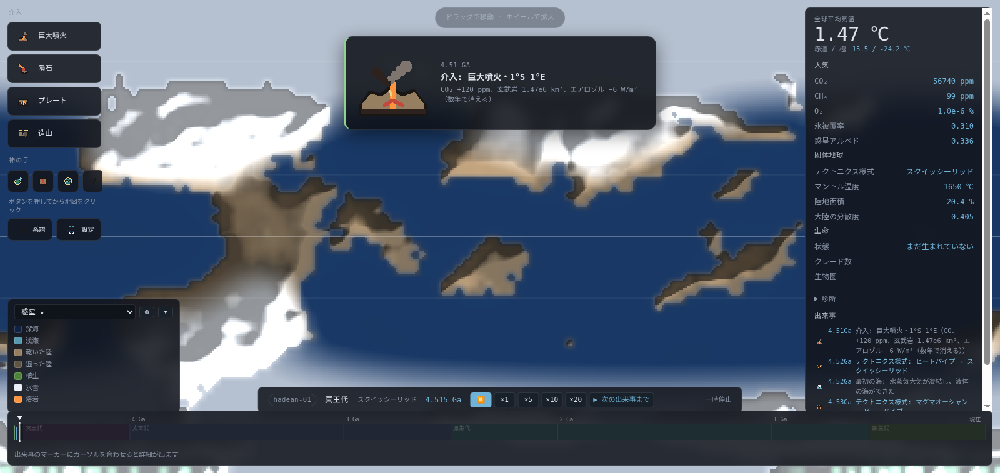
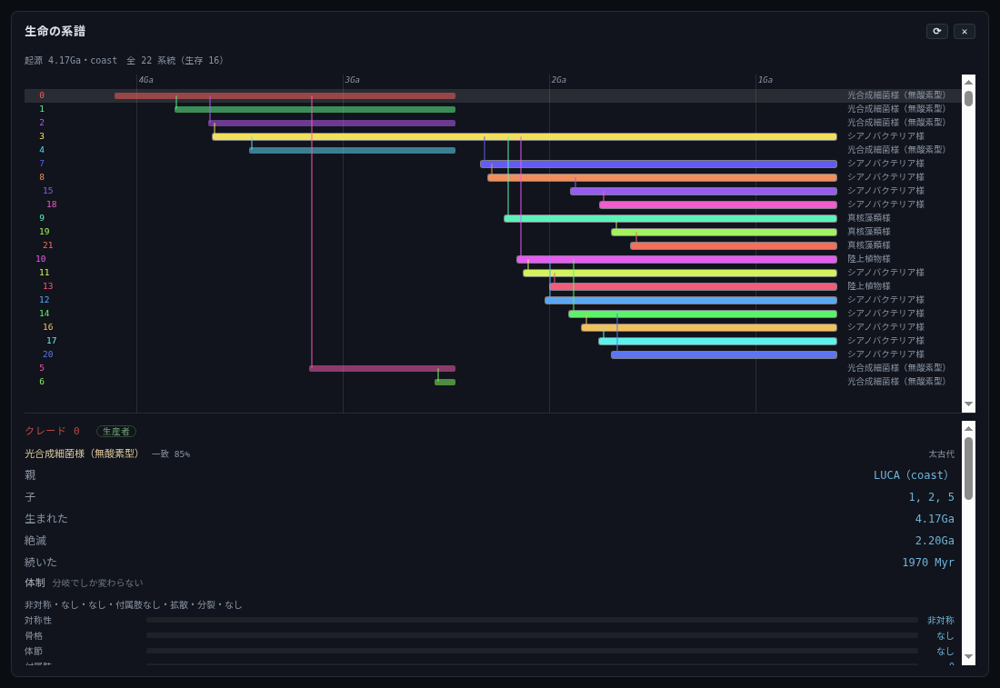
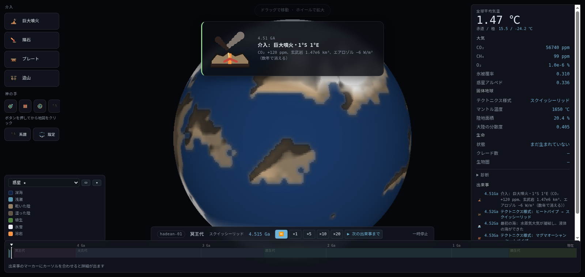

# Gaia Protocol

**45.4 億年の惑星シミュレータ。** 気候・炭素循環・水循環・プレートテクトニクス・
海洋・生命を結合して、惑星の一生を通しで回す。


> 上は実際の出力（seed `gaia-6`・全史 48 コマ・256×128）。マグマオーシャンから始まり、
> 海ができ、大陸が育ち、氷が来ては去り、緑が乗る。**台本はありません。**

`MIT` ・ TypeScript + Vite ・ 物理テスト **158 件** ・ 総合監査 **28 項目**

> このアニメーションは `npx vite-node scripts/probes/probe-anim.ts` が作っています。
> ffmpeg も ImageMagick も使わず、**自作の PNG エンコーダを APNG に拡張**して
> 出力しています（`scripts/png.ts`）。GIF と違って色を 256 に減らさないので、
> 惑星の連続階調がそのまま残ります。

---

SimEarth 系譜の惑星シミュレーション・ゲーム。

プレイヤーは惑星そのものではなく、惑星を**自己調節系（ガイア）として成立させる立場**に立つ。
地質・大気・生命・文明が相互にフィードバックし合う一つの系を、45億年かけて安定させるのが目的。

ただし **ガイアは達成されるとは限らない。** 生命はしばしば惑星を殺す。
安定した惑星とは、壊れなかった試行のことである（逐次選択, Lenton et al. 2018）。

**科学的な立脚点は 2020 年代の地球科学・古生物学・考古学に置く。**
SimEarth (1990) が前提としていた強いガイア仮説、進化のはしご、無条件の風化サーモスタット、
文明の段階論は、いずれも現在では覆っている。詳細は [docs/06-science-basis.md](docs/06-science-basis.md)。

## 遊び方

```bash
npm install
npm run dev        # → http://localhost:5180/
```



**時間を進める** — 下中央の速度の段（`×1` = 10 万年/秒 … `×20` = 200 万年/秒）。
★**どの時代でも同じ年数/秒**で進む。`×20` は物理から決まる上限で、
これを超えると風化サーモスタットが追随できず嘘になる。

**`▶ 次の出来事まで`** — 何も起きない時代を飛ばして、起きた瞬間に止まる。
45.4 億年を漫然と眺めなくてよい。

### 惑星に手を出す

左の列のボタンを押すと**照準**になり、**地図をクリックした場所**に効く。
構えると「即時 / その場 / 起こりうること / 空振り」が出る。

| 介入 | 何が起きるか |
|---|---|
| **巨大噴火** | その場に洪水玄武岩 150 万 km³。先に寒くなり（エアロゾル）、あとから暖かくなる（CO₂） |
| **隕石** | 数年〜数十年の強い寒冷化。氷が広がってそのまま氷期に入ることがある |
| **プレート** | そのプレートだけ向きが変わる。効くのは**数千万年後**。超大陸の分裂の引き金 |
| **造山** | 周りから中心へ地殻を寄せる。侵食 → 風化 → CO₂ 低下 |
| **神の手** | 生命の傾向を押す（光合成へ / 脳へ / 好気呼吸へ）、水平伝播 |

★**神の手は能力を与えない。勾配を傾けるだけ**なので、その形質が不利なら
選択が次の 100 万年で戻す。**効いたかどうかは系譜タブで読む。**

### 惑星を読む

- **レイヤ**（左下）— 23 種類。惑星・標高・気温・氷・風化レジーム・河川・
  プレート・地殻年代・海底熱水・湧昇・生物量・優占クレード・多様性…
  ★**凡例に「絶対目盛りか相対か」が書いてある**（多くは相対）
- **◍ ボタン** — 平面 ⇄ 球体。★正距円筒は極を引き伸ばすので、
  球にすると**氷冠が正しい大きさで見える**
- **虫眼鏡** — 介入を構えていないときに地図をクリック。
  ★**1 マスに 1 種族ではない**。最大 16 クレードが取り分で同居している
- **生命の系譜** — 絶滅したものも含む全系統の樹。遺伝子地図つき



> 系統樹。横軸は 45.4 億年（下のタイムラインと同じ軸）。右端は
> 「地球で言えば何に近いか」で、**種名を引いているのではなく形質から計算**している。
> 該当が無ければ「地球に該当なし」と出る —— それは*地球が通らなかった組み合わせ*
> に進化したという情報そのもの。



## ドキュメント

| ファイル | 内容 |
|---|---|
| [docs/00-concept.md](docs/00-concept.md) | コンセプト、原典分析、差別化方針 |
| [docs/01-simulation-model.md](docs/01-simulation-model.md) | 気候・炭素循環・水循環・地質の数理モデル |
| [docs/02-life-and-civilization.md](docs/02-life-and-civilization.md) | 進化ツリー、生態系、文明 |
| [docs/03-gameplay.md](docs/03-gameplay.md) | 介入、Ω 経済、勝敗条件、UI |
| [docs/04-architecture.md](docs/04-architecture.md) | 技術構成、データレイアウト、モジュール分割 |
| [docs/05-roadmap.md](docs/05-roadmap.md) | マイルストーンと各段階の検証テスト |
| [docs/06-science-basis.md](docs/06-science-basis.md) | **科学的基礎 — 1990年からの改訂点と出典** |
| [docs/07-art-spec.md](docs/07-art-spec.md) | ドット絵アイコンの発注仕様 |

作業中の記録は [WORK-IN-PROGRESS.md](WORK-IN-PROGRESS.md)、
**踏んだ罠の一覧**は [CLAUDE.md](CLAUDE.md)（56 件）。

## いま何ができるか

- 惑星を生成し、**45.4 億年を通して**気候・炭素・水・固体地球・海洋・生命が結合して動く
- テクトニクス様式がマントル熱史から創発する（マグマオーシャン → … → モバイルリッド）
- 大陸が動き、衝突し、山ができ、川が削る。超大陸が集合と分裂を繰り返す
- 風化サーモスタットが効いたり、供給律速で弱ったりする
- LIP が LLSVP の縁の通過で起きる（予測可能な災厄）
- **なぜ気温が / CO₂ が変わったかを寄与分解パネルで読める**
- **生命が生まれ、進化し、惑星の大気を変える**（下記）
- タイムラインに出来事が刻まれ、**地図をクリックして介入**できる
  （噴火・隕石・プレート・造山、そして**神の手**＝進化への介入）
- **平面と球体を切り替えられる**。レイヤごとに凡例が出る
- **虫眼鏡**でマスの中身（同居しているクレードの取り分・能力・形質）を読める
- **生命の系譜タブ**で全系統（絶滅したものも含む）と遺伝子を辿れる

### 生命の鎖が最後まで繋がっている

```
起源 → LUCA → 光合成 → 酸素発生型（ハードステップ） → 大酸化事変
     → 好気呼吸 → 真核（ハードステップ） → 捕食者 → 脳 → 象徴（ハードステップ）
```

★**時期はどこにも書いていない。** 生物量とマントルの冷却と抽選から出る。

| | 出た惑星（8 seed） | 時期 | 地球 |
|---|---|---|---|
| 大酸化事変 | **8 / 8** | 0.92〜3.49Ga | 2.4Ga |
| 真核 | **4 / 8** | 0.60〜1.87Ga | 1.8〜2.1Ga |
| 象徴（知性） | **1 / 8** | — | 1 系統のみ |

**順序は一度も破れていない。** 起きない惑星があるのは設計どおり
（ハードステップ。`docs/02` §2.1b）。

文明はまだ無い（M7）。

### 45.4 億年通しても壊れない

`npm run audit -- --width 96` で全史を通して 28 項目を検査する（96×48 で約 29 分）。

```
28 項目  PASS 25  WARN 2  FAIL 1
```

| | 45.4 億年の実測（seed audit） | 地球 |
|---|---|---|
| 顕生代の気温 | **17.8 ℃** | 17〜20 |
| 顕生代の CO₂ | **731 ppm** | 300〜3000 |
| 陸地面積（全史の中央値） | **21.4 %** | 29.2 |
| 海底熱水の総出力 | **3.3 TW** | 2.8±1 |
| 海洋のリン在庫 | **2.5e15 mol** | 2.9e15 |
| エネルギー収支の不平衡 | **2.2e-4 W/m²** | ~0 |

**WARN と FAIL は意図して残している**:

- 太古代が 1.5℃（10℃ 以上を期待）= **暗い太陽のパラドクスの残り**
- 熱塩循環が −10 Sv（塩分枝＝逆転循環に落ちている）
- FAIL は `degassingFollowsCrust` の**停止検出**（直すと悪化することを実測済み）

## 検査を回す

```bash
npm test           # 物理テスト 158 件（約 20 分）
npm run build      # 型チェック + プロダクションビルド

npm run audit -- --width 96   # 総合監査（収支・停止検出・数値解法・全史）
npm run smoke                 # ブラウザ通し確認（要 npm run dev）

npx vite-node scripts/probes/probe-look.ts    # 時代ごとの見た目を PNG に
npx vite-node scripts/probes/probe-life.ts    # 生命の獲得の鎖がどこで切れているか
npx vite-node scripts/probes/probe-anim.ts    # 上のアニメーションを作り直す

# 系統樹の見た目を確かめる（smoke は冥王代までしか進まないため）
npx vite-node scripts/probes/probe-phylo.ts --seed gaia-6 --gyr 3.5
npx vite-node scripts/phylo-shot.ts           # -> snapshots/phylo.png
```

★**この配管では、数字を出すたびに条件（解像度・seed・パラメータ）を添える。**
単一ランの終端値では判断しない。踏んだ罠は [CLAUDE.md](CLAUDE.md) に 59 件。

`proto/` は TypeScript を書く前の数値検証（Python）。[proto/RESULTS.md](proto/RESULTS.md) 参照。

## ライセンス

**MIT License** — Copyright (c) 2026 Nilklops Inc. 詳細は [LICENSE](LICENSE)。

コード・ドキュメント・設定に適用されます。

★**画像素材だけ別ライセンス** —— `public/art` のイラストと `public/icons` の
ドット絵は **CC BY-NC-SA 4.0**（表示・非営利・継承）です（[public/LICENSE](public/LICENSE)）。

- **実行時依存はゼロ**（`dependencies` が空）。配布物に他者のコードは含まれません
- ビルドツールは MIT 43 / Apache-2.0 2 / ISC 2 / BSD-3-Clause 2 で、いずれも両立します
- 引用している論文は**方程式を実装している**だけで、本文・図表・付属コードの
  転載や流用はしていません（`docs/06-science-basis.md` に出典）

## 技術スタック

TypeScript + Vite + Canvas。シミュレーションは Web Worker、決定論的。

WebGPU の compute 実装は入っているが、**既定では使わない**。
気候ソルバは Newton + CG で**逐次**（内積の結果が次の一歩を決める）ため
1 solve が 753 ディスパッチになり、3.3 万セルでは**固定費が計算の 50 倍**だった
（実測 CPU 102ms / GPU 358ms）。`npm run gpu-verify` が一致と速度の両方を検査し、
遅ければ CPU を選ぶ。**「その装置が使えること」と「その装置が速いこと」は別**
（[docs/04 §8](docs/04-architecture.md)、`CLAUDE.md` の 28〜31）。

## ステータス

| | | |
|---|---|---|
| 事前数値検証 | ✅ | 25/25 合格。[proto/RESULTS.md](proto/RESULTS.md) |
| **M0 惑星が見える** | ✅ | グリッド・PRNG・FieldStore・地形生成・描画 |
| **M1 気候が回る** | ✅ | 2次元 EBM、寄与台帳、Worker、UI。46/46 + 14/14 合格 |
| **M1.5 太古代の大気** | ✅ | 有機ヘイズの反温室効果 |
| **M2 サーモスタット** | ✅ | 風化の2レジーム、炭素循環、時間駆動。15/15 合格 |
| **M3 水・侵食・地形** | ✅ | 降水・河川・stream power 侵食。16/16 合格 |
| **M4 固体地球** | ✅ | マントル熱史、プレート、LLSVP/LIP、深部循環。21/21 合格 |
| **M4.7 海洋** | ✅ | 熱塩循環（Stommel）、エクマン湧昇、西岸境界流、リン |
| **M5 生命** | ✅ | 前生命化学・ゲノム・個体数・酸素・栄養段階・系譜 UI。158/158 合格 |
| M6 社会 | — | |
| M7 ゲームになる | — | Ω 経済と文明 |

### M4 の到達点 — フェーズ1（物理的な惑星）完成

マントル熱史から**テクトニクス様式が創発**し、プレートが動き、衝突が山を作り、
LLSVP の縁の通過が LIP を起こす。

| | |
|---|---|
| 様式の遷移 | マグマオーシャン → ヒートパイプ → モバイルリッド（マントル温度から創発） |
| 大陸地殻の体積 | 0.96〜1.03 で保存（解像度非依存） |
| 造山 | 400 Myr で最高標高 3468 → 6377 m |
| 海洋地殻 | `depth = 2600 + 350√age`（<20Myr −2969m vs >80Myr −4499m） |
| LIP | LLSVP 縁の通過で発生（ランダムではない） |
| 脱氷 → 火山 | **34.7 倍**（アイスランドの実測 30〜50 倍） |
| 暴走温室 → プレート停止 | ヒステリシスあり（一度失うと再開しにくい） |

> **`docs/01-6.6a` の「金星化と動かない星は同じ経路」が実装で確認できた。**
> 地表 460℃ と水の喪失でプレートが停止し、条件が戻っても再開の閾値の方が厳しい。

### M3 の到達点

3 セル循環 + 東西方向の水蒸気移流による降水、D8 + 窪地埋めによる河川網、
stream power law による侵食。**降水 → 侵食 → 風化供給**のループが繋がった。

| | モデル | 現実 |
|---|---|---|
| 全球平均降水 | 989 mm/yr | ~1000 |
| 陸上平均降水 | 723 mm/yr | ~750 |
| 赤道 / 緯度30° | 1401 / 345 mm/yr | 乾燥帯が出る |
| 雨陰（風下/風上） | 0.32 | — |
| 最大河川の集水域 | 陸地の 2.1% | アマゾンは 4% |

> **`docs/01-6.6c` に書いた「気候がサーモスタットを自己修復する負のループ」は符号が逆だった。**
> 供給（侵食）の温度感度 **3.7 %/K** に対し需要（風化）は **7.6 %/K**。
> 需要が 2 倍速く増えるので、**暑い惑星ほどサーモスタットが弱い**。
> 造山だけが供給を一方的に増やすので、正しい向きに効く唯一の梃子。

### M2 の到達点

風化サーモスタットの 2 レジームと炭素循環。**定常が厳密に閉じる**（net = 7e−18 Gt-C/yr）。

| 侵食倍率 | 平衡 CO₂ | 全球平均気温 | 供給律速の面積 |
|---|---|---|---|
| 2.00 | 238 ppm | 13.6℃ | 14% |
| 1.00 | **280 ppm** | **14.4℃** | **25%** |
| 0.50 | 392 ppm | 15.9℃ | 45% |
| 0.20 | 1375 ppm | 20.2℃ | 83% |

CO₂ 4 倍の摂動からの回復時定数 **τ = 210 kyr**（1D: 220、文献 200–400 kyr）。

> **1 次元プロトタイプで見つけた「侵食 0.67 の崖」は 2 次元で再現しなかった。**
> 惑星全体を 1 セルとして扱ったことによるアーティファクトで、
> 実際は**滑らかだが強く加速する応答**（感度が 6.5 倍に増大）。
> 代わりに**供給律速の面積割合が先行指標**になり、CO₂ が動く前に地図で見える。
> 詳細は [docs/01 §4.2](docs/01-simulation-model.md)。

### M1 の到達点

| | モデル (2D) | 目標 / 現実 |
|---|---|---|
| 全球平均気温 | **14.50 ℃** | 14–15 |
| 赤道 / 極 | **27.5 / −20.4 ℃** | ~27 / ~−25 |
| 氷被覆率 | **0.115** | ~0.11 |
| 惑星アルベド | **0.297** | 0.29 |
| ECS (2×CO₂) | **3.00 ℃** | IPCC AR6: 3.0 |
| スノーボール分岐 | **S/S₀ = 0.83** | — |
| 凍結からの脱出 | **1.03**（ヒステリシス幅 0.20） | — |
| 暴走温室 | **1.12** | 文献 ~1.1 |
| 収支の不平衡 | **3e−7 W/m²** | ~0 |

**寄与分解パネルが動いている** — 気温変化を日射・温室効果 (CO₂/CH₄)・氷アルベド・
地表アルベド・反温室効果 (ヘイズ) に厳密に分解する（残差なし。テストで検証）。

### M0 の到達点

| 合格条件 | 結果 |
|---|---|
| 512×256 が 60fps で描画される | ✅ レイヤ再生成 2〜5ms、通常フレームは drawImage のみ |
| 東西の継ぎ目が見えない | ✅ 巻き付き境界の高低差が内部と統計的に同等（比 0.6〜1.4） |
| 同一 seed で同一地形 | ✅ テストで全セル一致を検証 |

生成される惑星の統計（512×256、地球の参照値と比較）:

| | モデル | 地球 |
|---|---|---|
| 陸地面積比 | 0.290（面積重み付き分位点で厳密に制御） | 0.29 |
| 陸の平均標高 | 500〜900 m | 840 m |
| 海の平均深度 | −2800〜−3100 m | −3688 m |
| 最高標高 | 4100〜5600 m | 8849 m |

最高標高と海溝が浅いのは**衝突帯と沈み込み帯が無いから**で、M4 のプレートテクトニクスで出るべきもの。
M0 の地形生成は M4 で全面的に置き換わる暫定実装。
