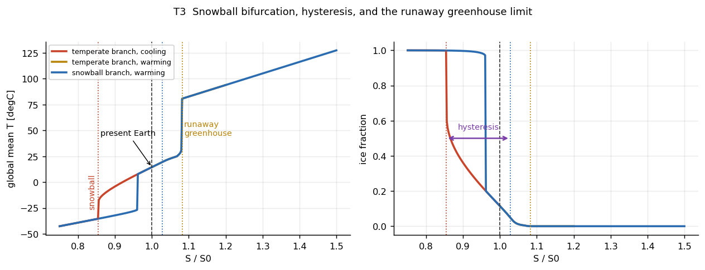
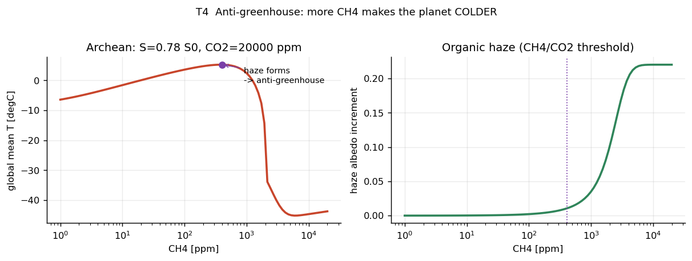
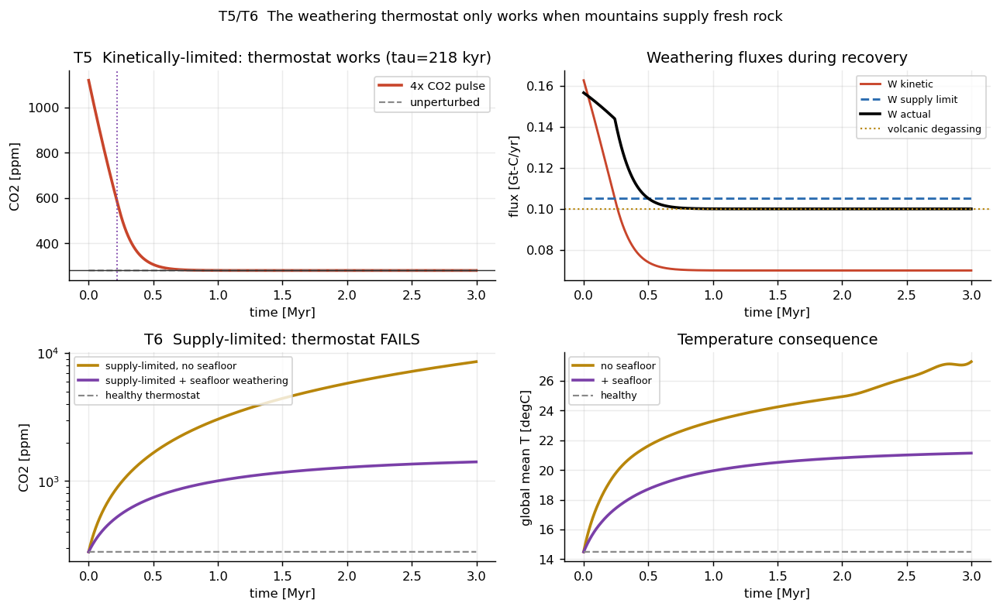
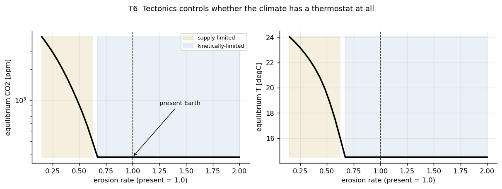

# 数値検証の結果

`docs/05-roadmap.md` の **M1 / M1.5 / M2** の合格条件を、TypeScript を書く前に Python で検証した。

```
python3 calibrate.py     # 既定パラメータの較正（再現用）
python3 experiments.py   # 24 項目の検証 + figures/ に図を出力
```

**結果: 24 / 24 合格。M1・M1.5・M2 は実装に進んでよい。**

---

## 1. 較正されたパラメータ

自由度は 5 つ。`A0` が全球平均を、`B` が気候感度を、`D`/`k_moist` が南北傾度を、
`alpha_ice`/`dT_ice` が氷アルベドフィードバックの強さを主に決める。
互いに強く干渉するので **`A0` と `B` は入れ子の brentq で同時に解いた**（`calibrate.py`）。

| パラメータ | 値 | 意味 |
|---|---|---|
| `A0` | 209.134 W/m² | OLR の切片 |
| `B` | 2.2206 W/m²/K | 水蒸気・気温減率・雲を込みにした実効長波応答 |
| `D` | 0.28 W/m²/K | 乾燥渦による南北熱輸送 |
| `k_moist` | 2.0 | 潜熱輸送の寄与（暖かいほど強い） |
| `alpha_free` / `alpha_ice` | 0.27 / 0.55 | 惑星アルベド（表面アルベドではない） |
| `dT_ice` | 6.0 K | 氷縁の平滑化幅（季節変化のぼやけ） |

### 再現された現在の地球

| 量 | モデル | 現実 | 判定 |
|---|---|---|---|
| 全球平均気温 | **14.50 ℃** | 14–15 | ✓ |
| 赤道 | **28.2 ℃** | ~27 | ✓ |
| 極 | **−23.8 ℃** | ~−25 | ✓ |
| 氷被覆率 | **0.115** | ~0.11 | ✓ |
| 惑星アルベド | **0.303** | 0.29 | ✓ |
| ECS (2×CO₂) | **3.00 ℃** | IPCC AR6: 3.0 (2.5–4.0) | ✓ |

---

## 2. M1 — 気候の分岐構造



| 分岐 | モデル | 文献値 | |
|---|---|---|---|
| スノーボールへの落下 | **S/S₀ = 0.854** | EBM で 0.85–0.92 | ✓ |
| 凍結からの脱出 | **S/S₀ = 1.028** | ヒステリシス幅 0.17 | ✓ |
| 暴走温室 | **S/S₀ = 1.082** | ~1.1 (Goldblatt et al.) | ✓ |

**現在の地球は両側の崖から 15% / 8% しか離れていない。** これはゲームの緊張感の物理的根拠になる。

気候感度の状態依存性:

| CO₂ 区間 | 昇温 |
|---|---|
| 140 → 280 | 3.19 ℃ |
| 280 → 560 | **3.00 ℃**（現在の ECS） |
| 560 → 1120 | 2.85 ℃ |
| 1120 → 2240 | 2.11 ℃ |
| 4480 → 8960 | 1.80 ℃（無氷極限 3.7/B = 1.67 に漸近） |
| 8960 → 17920 | **暴走**（82 ℃ へ飛躍） |

> **設計への含意**: 温暖化が進むと感度は一旦**下がる**（氷アルベド寄与が枯れるため）。
> 「暖かいほど脆い」という直感は 25 ℃ を超えるまで成立しない。
> ゲーム内の解説でこれを説明できると、寄与分解パネルの説得力が上がる。

---

## 3. M1.5 — 有機ヘイズの反温室効果



太古代の設定（S = 0.78 S₀、CO₂ = 20,000 ppm）で CH₄ を掃引した。

- 昇温は **CH₄ ≈ 400 ppm でピーク（5.3 ℃）**を打つ
- そこから CH₄ を増やすと CH₄/CO₂ 比が閾値 0.1 を超えてヘイズが生成され、
  **−43.7 ℃ まで 49 ℃ 低下してスノーボールに落ちる**

**「温室効果ガスを増やしたのに惑星が凍る」が動作した。** SimEarth には無かった挙動であり、
暗い太陽シナリオ（#2）で「メタンを増やせばいい」という 1990 年的な直感を裏切る仕掛けとして使える。

---

## 4. M2 — 風化サーモスタットの2レジーム ★本作の核



### 速度論律速レジーム — サーモスタットが効く

- 無擾乱で **280.0 ppm** に定常
- CO₂ 4 倍（1120 ppm）の摂動 → **280.0 ppm に完全復帰**
- 回復時定数 **τ = 218 kyr**（文献の 200–400 kyr と整合）

**予期していなかった発見**（右上パネル）: 4 倍の摂動をかけた**直後は供給律速に入る**。
実際の風化（黒）が供給上限（青破線）に張り付き、0.5 Myr 経ってから速度論曲線に戻る。
つまり **大きな摂動は一時的にサーモスタットを飽和させ、回復を遅らせる**。
これは意図して設計した挙動ではなく、2 レジームを実装した結果として出た。ゲーム的にも良い。

### 供給律速レジーム — サーモスタットが壊れる

侵食速度を 0.4 倍に落とす（＝超大陸の平坦化）と:

| 条件 | 3 Myr 後の CO₂ | 全球平均気温 |
|---|---|---|
| 健全なサーモスタット | 280 ppm | 14.5 ℃ |
| 供給律速（海底風化あり） | 1,412 ppm | 21.1 ℃ |
| 供給律速（海底風化なし） | 8,560 ppm・**単調増加** | 27.4 ℃ |

### レジーム図 — 崖がある ★



**これが最も重要な結果。**

侵食速度を 2.0 → 0.15 と落としていくと、**侵食 ≈ 0.67 までは何も起こらない**。
サーモスタットが CO₂ を 280 ppm に固定し続ける。そこを下回った瞬間に平衡 CO₂ が急上昇し、
0.15 では 5,000 ppm を超える。

> **緩やかな地質学的変化が、閾値を跨いだ瞬間に気候の破局に変わる。**

ゲーム設計としてこれ以上ない性質:
- プレイヤーは長い間「何も起きていない」と感じる
- 崖を越えると急激に悪化し、しかも**戻すのが遅い**
- 「新鮮岩石の在庫」レイヤ（docs/03-5.2）はこの崖までの距離を可視化するもの

### 回復の非対称性

| 介入 | 4,417 ppm からの半減時間 |
|---|---|
| 侵食 2.5×（ヒマラヤ級の造山） | **0.19 Myr** |
| 侵食 1.0×（現在並みに戻すだけ） | **0.54 Myr**（2.9 倍遅い） |

海底風化は供給律速を受けないため、陸上が完全に供給律速でも**最後の安全網**として働き、
最終的には 280 ppm に戻す。ただし極めて遅い。

---

## 5. 実装で踏んだ罠 — TypeScript 版で繰り返さないこと

較正の過程で 5 つのバグを踏んだ。いずれも**モデルは正しく書けているのに結果が現実と合わない**類で、
原因の特定に時間がかかった。TS 実装時に同じ場所を踏まないよう記録する。

| # | 症状 | 原因 | 対処 |
|---|---|---|---|
| 1 | ECS が 11.4 ℃（現実の 4 倍） | 水蒸気フィードバックに**局所**温度の指数関数を使った。熱帯セルだけが局所的に暴走条件に入る | 通常域は線形 OLR (Budyko 型)、暴走温室は**全球平均**温度の別項に分離 |
| 2 | 南北温度傾度が消えた（極が −5 ℃） | 上を直そうとして水蒸気項を全球平均にしたら、極が乾燥して温室効果が弱いという実在の効果まで消えた | `B` に込みにする。傾度は `D`/`k_moist` で作る |
| 3 | 赤道と極を同時に合わせられない | 定数拡散の EBM の既知の限界 | **湿潤拡散** `D_eff = D(1 + k·(exp((T−T₀)/Tq) − 1))`。潜熱輸送は暖かいほど強い |
| 4 | 定常 CO₂ が 280 → 296 ppm にずれる | 風化式の基準温度が 15.0 ℃、EBM の現在値が 14.5 ℃。**0.5 K のずれ** | 風化の `T0` を EBM の全球平均に一致させる。`exp((T−T0)/13.7)` なので基準ずれが定常点を大きく動かす |
| 5 | 分岐図に全球平均 50–80 ℃ の枝が出た | 冷却掃引を S/S₀ = 1.10 から始めた。その時点で既に**暴走温室分枝**にいた | 連続法（continuation）の起点は必ず現在の地球（S/S₀ = 1.0）にする |

さらに**炭素収支の閉じ忘れ**（`F_volc = W0 + W_sf0` を満たさないと定常が 280 ppm にならない）。
これは `docs/04-8` の保存則テストで自動検出できるはずのもので、
**寄与台帳を M1 の時点で入れるべき**という設計判断（`docs/05` M1）の正しさを裏付けた。

---

## 6. 設計文書への反映が必要な箇所

| 文書 | 修正内容 |
|---|---|
| `docs/01-3.3` | ヘイズを `A`（OLR）の項として書いていたが、**アルベドに入れる方が「太陽光を反射する」という記述に忠実**。プロトタイプはアルベド側で実装した |
| `docs/01-3.1` | `B_planck = 2.1` としていたが、較正値は **2.2206**。また「プランク応答」ではなく「水蒸気・気温減率・雲込みの実効値」と呼ぶべき |
| `docs/01-3.1` | 熱輸送 `D` を定数としていたが、**湿潤拡散（温度依存）でないと緯度分布が合わない**。TS 実装でも必要 |
| `docs/01-4.2` | 供給律速の**閾値的な振る舞い（侵食 0.67 の崖）**を明記する。連続的な劣化ではない |
| `docs/05` M1 | 合格条件に具体的な数値（分岐 0.854 / 脱出 1.028 / 暴走 1.082）を入れられる |

---

## 7. 2次元化で変わること

このプロトタイプは 1 次元（緯度のみ）。本番の 2 次元化で加わるのは:

- **陸海コントラスト** — 熱容量・アルベド・水循環が東西方向に不均一になる
- **大陸配置の効果** — 極に大陸があると氷床が乗る（現在の氷期の原因）
- **地形性降水と雨陰** — `runoff` の空間分布 → `erosionRate` → 供給律速の**空間分布**

最後の点が重要で、**2 次元では惑星の一部だけが供給律速に落ちうる**。
1 次元では「サーモスタットが効くか壊れるか」の二択だったが、
2 次元では「大陸のどこが新鮮岩石を供給しているか」がゲームの読みどころになる。

再較正は必要だが、**「全球平均・南北傾度・氷被覆率・ECS を同時に満たす」という 4 点拘束の形は変えないこと。**
1 つずつ合わせると必ず他が壊れる（実際に 3 回壊した）。
